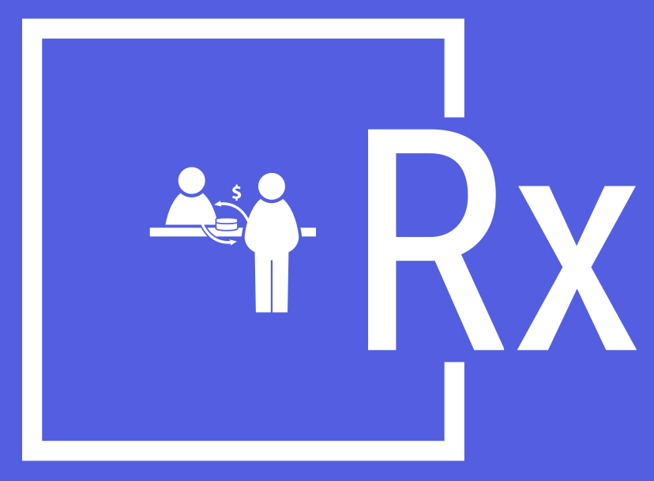

# RentX

<p align="center">
  
  <span style="display: inline-block; vertical-align: middle; margin-left: 10px; font-size: 35px;">— Afford More, Own Less.</span>
</p>


##
[](https://img.shields.io/badge/pipeline-passed-green
) 
[](https://img.shields.io/badge/coverage-86%25-orange
)
[](https://img.shields.io/badge/coverage-90%25-blue
)


RentX provides a localized platform for users to buy, rent, or sell items, offering affordable options during financial hardships, convenience for newcomers in a city, a comprehensive commerce solution, and an eco-friendly approach to reduce e-waste, while also catering to trend-conscious consumers.

## Table of Contents

- [RentX - Backend Setup](#rentx---backend-setup)
    - [Libraries Used](#libraries-used)
    - [Prerequisites](#prerequisites)
    - [Getting Started](#getting-started)
    - [References of technologies used](#references-of-technologies-used)
- [RentX - UI Setup](#rentx---ui)
    - [Prerequisites](#prerequisites-1)
    - [Getting Started](#getting-started-1)
    - [Commands](#commands)
    - [References of technologies used](#reference-of-technologies-used)
    - [Opinionated Dev Environment](#opinionated-dev-environment)
    - [Credits](#credits)
- [Features](#features)
- [Developers](#developers)
- [License](#license) 

### Overview

This repository contains two folder, `ui` and `server` which stores respective code.

***


# RentX - Backend Setup

## Libraries Used

List the libraries and their versions used in the project.

- Spring Boot: `v3.1.4`
- Spring Framework: `v3.1.4`
- Spring Cloud GCP: `v4.1.1`
- Spring Cloud: `v2022.0.1`
- Spring Boot Starter Data JPA: `v3.1.4`
- java-jwt: `v4.4.0`
- Spring Boot Starter Web: `v3.1.4`
- Spring Boot DevTools: `v3.1.4`
- MySQL Connector/J: `v8.0.33`
- Spring Boot Starter Test: `v3.1.4`
- Lombok: `v1.18.20.0`
- Spring Security Core: `v6.1.4`
- MapStruct: `v1.5.5.Final`
- Spring Security Config: `v6.0.3`
- Spring Security Web: `v6.0.3`
- Jakarta Validation API: `v3.0.2`
- Spring Security OAuth2 Client: `v6.1.4`
- Spring Boot Starter Mail: `v3.1.4`
- Apache Velocity: `v1.7`
- Mockito Core: `v5.6.0`
- JUnit: `v4.13.2`
- TestNG: `v7.8.0`
- Spring Cloud GCP Starter Storage: `v4.1.1`

## Prerequisites

- Java `v19.0.2`
- JDK `v17`
- Maven `v3.9.5`

## Getting Started

Follow these steps to set up and run the project locally.

### 1. Clone the Repository
```bash
 git clone git@git.cs.dal.ca:courses/2023-fall/csci-5308/Group08.git 
 OR
 git clone https://git.cs.dal.ca/courses/2023-fall/csci-5308/Group08.git
```
### 2. Navigate to the project directory
```bash
cd Group08/server
```
### 3. Build the project
```bash
mvn clean install
```
### 4. Deploy the application
```bash
mvn package 
```
### 5. Run the application
```bash
mvn spring-boot:run
```

The application will be accessible at `http://localhost:8080`.

### References of technologies used:
- [Spring Boot](https://spring.io/projects/spring-boot)
- [Spring Framework](https://spring.io/projects/spring-framework)
- [Spring Cloud GCP](https://spring.io/projects/spring-cloud-gcp)
- [Spring Cloud](https://spring.io/projects/spring-cloud)
- [Spring Boot Data JPA](https://spring.io/guides/gs/accessing-data-jpa/)
- [Java JWT](https://github.com/auth0/java-jwt)
- [Spring Boot Web](https://spring.io/guides/gs/spring-boot/)
- [Spring Boot DevTools](https://docs.spring.io/spring-boot/docs/current/reference/html/using.html#using.devtools)
- [MySQL Connector/J](https://dev.mysql.com/doc/connector-j/en/)
- [Spring Boot Testing](https://docs.spring.io/spring-boot/docs/current/reference/html/spring-boot-features.html#boot-features-testing)
- [Project Lombok](https://projectlombok.org/)
- [Spring Security Core](https://spring.io/projects/spring-security)
- [MapStruct](https://mapstruct.org/)
- [Spring Security Config](https://spring.io/projects/spring-security)
- [Spring Security Web](https://spring.io/projects/spring-security)
- [Jakarta Validation](https://jakarta.ee/specifications/validation/3.0/)
- [Spring Security OAuth](https://spring.io/projects/spring-security-oauth)
- [Spring Boot Mail](https://docs.spring.io/spring-boot/docs/current/reference/html/appendix-application-properties.html#mail-properties)
- [Apache Velocity](http://velocity.apache.org/engine/1.7/user-guide.html)
- [Mockito](https://site.mockito.org/)
- [JUnit](https://junit.org/junit4/)
- [TestNG](https://testng.org/doc/)
- [Spring Cloud GCP Storage](https://spring.io/guides/gs/storing-data-google-cloud-storage/)


# RentX - UI


## Prerequisites

- [NodeJS](https://nodejs.org/en) `v20.x`
> you can use [nvm](https://github.com/nvm-sh/nvm) to manage node versions
- [pnpm](https://pnpm.io/installation#using-npm) `v8.x`

check if exists

```sh
node --version
pnpm --version
```
## Getting Started
Follow these steps to set up and run the project locally.

### 1. Clone the Repository
```bash
 git clone git@git.cs.dal.ca:courses/2023-fall/csci-5308/Group08.git 
 OR
 git clone https://git.cs.dal.ca/courses/2023-fall/csci-5308/Group08.git
```
### 2. Navigate to the project directory
```bash
cd Group08/ui
```
## Commands

<table>
<tbody>
<tr>
<th>&nbsp;title</th>
<th>command</th>
<th>&nbsp;description</th>
</tr>
<tr>
<td>development</td>
<td>

```
pnpm dev
```

</td>
<td>starts development server</td>
</tr>
<tr>
<td>build</td>
<td>

```
pnpm build
```

</td>
<td>generates bundle files in <u>build</u> directory</td>
</tr>
<tr>
<td>preview build</td>
<td>

```
pnpm preview
```

</td>
<td>preview of generated bundle by <i>build</i> command</td>
</tr>
<tr>
<td>lint</td>
<td>

```
pnpm lint
```

</td>
<td>find the code formatting errors and enforce consistent code style</td>
</tr>
<tr>
<td>fix lint</td>
<td>

```
pnpm fix:lint
```

</td>
<td>automatically fix most lint errors</td>
</tr>
<tr>
<td>test</td>
<td>

```
pnpm test
```

</td>
<td>run unit tests</td>
</tr>
<tr>
<td>watch test</td>
<td>

```
pnpm test:watch
```

</td>
<td>run unit tests in watch mode</td>
</tr>
</tbody>
</table>

## Reference of technologies used

- [React](https://react.dev/)
- [React Router](https://reactrouter.com/en/main)
- [Typescript](https://www.typescriptlang.org/)
- [Vite](https://vitejs.dev/)
- [Tailwind](https://tailwindcss.com/)
- [LessCSS](https://lesscss.org/)
- [Antd](https://ant.design/)

## Opinionated Dev Environment

- Use `Visual Studio Code - v1.82.2`.
- Install extensions
    - [ESLint](https://marketplace.visualstudio.com/items?itemName=dbaeumer.vscode-eslint)
    - [Prettier - Code formatter](https://marketplace.visualstudio.com/items?itemName=esbenp.prettier-vscode)
    - [Tailwind CSS IntelliSense](https://marketplace.visualstudio.com/items?itemName=bradlc.vscode-tailwindcss)
- create file at `.vscode/settings.json` from root of this repository and add the below snippet

```json
{
    "eslint.format.enable": true,
    "editor.codeActionsOnSave": {
        "source.fixAll.eslint": true 
    },
    "eslint.workingDirectories": [
        {
            "directory": "./ui",
            "changeProcessCWd": true
        }
    ]
}
```

This will automatically fix lint errors and apply code format defined in eslint and prettier on save file event.

## Credits

- Illustrations - https://undraw.co/illustrations

# Features

### Homepage

Once the user enter the website they will firstly engage with the homepage. For the RentX user can browse homepage and see which products are on sale. And, how many categories are there that they can use.


On the homepage they will get a suggested product section where they can browse suggested products and check which suits them best via advertisement.


And at the end users will get to know about how RentX is different than any other site. And what will they get if they choose RentX and rent or sell items from the seller.Apart from that we have Testimonials section where we post reviews from our customer.


### User Setting Page

Once the user register their account with the RentX they can add some datails in their user account. And update their details in the account.

In the user setting they can upload their profile image there and not only upload they can change it as many times they want.


Also, they can add/change their first name and last name in the setting itself. Other than that they can change their contact number as well.

Not only that but if a customer wants to delete their user profile they can do that as well without any difficulties.


Once the user updated their profile they will receive a message on the website that states "Profile Updated Successfully" , that confirms that changes have been added and user will be able to see the updated profile.


### Authentication
### login

If a user who has registered and already have a account on the RentX site they can login via login button on the homepage. There they need to enter the email they have used while the registration and password they have created at that time. And they will able to login with those details


### Registration

Also, if a user is new to the site they can use the "Don't have an account? Register" tag and, it will take users to the registration page and there they can be able to create new account for them.


### Seller

User can become seller. There is option in navigation to become seller. Users are shown the benefits of being seller. When user becomes seller, they can upload verification document additionally (We have put this as dummy feature). User must need to become seller in order to sell the product.

After being seller, users can add product with details like images, name, description and option to either sell or rent. As they add product, it will show up in the search.

After adding product for sell. User can edit or delete the product.


### product details page

User can nevigate to the product details whichever product they are interested in and in details page there are bunch of information about the product. like product image if the seller has uploaded more that one image of product then there will be a carousel of the product image.

Also, user can check what will be price of the product for sell and EMI, they can also check which product is uploaded by whome and when.

Apart from this , they can check product details under the product image. To confirm the extra features and full detail and functionality.


### Product Checkout, EMI

Users have an option to purchase the product from product page. User can click on pay and provide card details. Checkout depends on product sell type (rent or sell) and how user want to perform payments (EMI or full). On successful payment, product is purchased by User and shown in order details.


### Order details

Users can see the purchased products on orders page. It contains order image, name, description. It also contains payment details and reminder if rent or installment is due. And how much is already paid for that product and how much is left. User can also generate invoice of payments. User can also review the product.


# License
This project is licensed under the MIT License - see the [LICENSE.md](https://git.cs.dal.ca/courses/2023-fall/csci-5308/Group08/-/blob/development/License.md) file for details.
